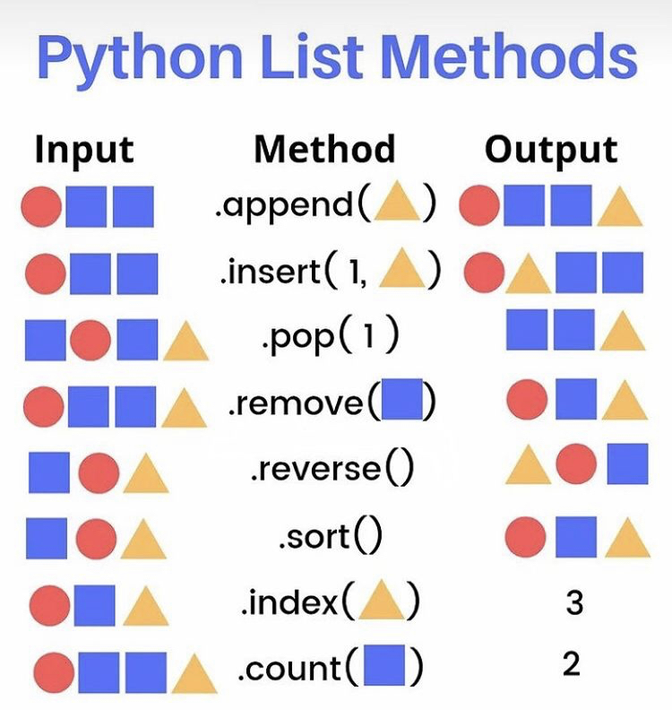

# Liste Veri Tipi

Listeler yapilari geregi `string`'lere oldukca benzerler. Tipki `string`'ler gibi index'lenirler, parcalanirlar ve degisik islemler yapabildigimiz metodlari iclerinde bulundururlar.


    Listelerin Stringlerden onemli bir farki ise;
    Stringler degistirilemez bir veri tipidir. Ancak, listeler degistirilebilir bir veritipidir.

Bir listede her veri tipinden eleman saklayabilirsiniz. Peki bu konuda ne gorecegiz ?

1. Liste olusturma
2. Indexleme ve Parcalama
3. Temel liste metodlari ve islemleri
4. ic ice listeler

## __Liste olusturma__
Listeler `[]` ifadesinin icindeki verilerden olusur.

__Ornegin:__ 
```python
# Degisik veri tiplerinden degerleri saklayabiliyoruz
liste1 = [1, 2, 3, "ali", 55.3, -9, 3.14]

# Bos liste olusturma
liste2 = []
liste3 = list()
```

## __Liste metodlari :__



---
## __Alistirma__
1. Programın çıktısı nedir ?

        liste = [1,2,3,4]
        liste =  liste + ["Murat"]
        print(liste)

2. liste1 değişkenin değeri nedir ? 

        liste = [1,2,3,4,5]
        liste * 3
        print(liste)

3. Programın çıktısı nedir ?

        liste = [1,2,3,4,5,6]
        print(liste[6])